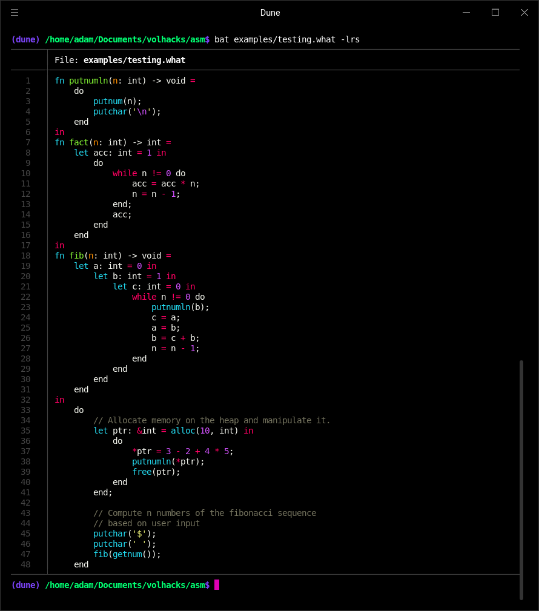

# tf



A collection of compilers based around compiling a high level language to a Brainfuck dialect.

***Built at, and for, the VolHacks V hackathon during October 2021.***

## Usage

To install, you must download Rust from [here](https://www.rust-lang.org/).

```bash
# Install directly from git with cargo
cargo install --git https://github.com/adam-mcdaniel/tf

# Or, alternatively, the repo and install from source
git clone https://github.com/adam-mcdaniel/tf
cd tf
cargo install -f --path .
```

#### After Install

```bash
# Just run the `tf` executable!
$ tf
tf 0.1.0
Adam McDaniel:Vicky Chakpuang:Logan Wrinkle
A collection of the The Fuck? compiler tools to compile What? and assemble Why? and How?

USAGE:
    tf [FLAGS] [OPTIONS] <FILE>

FLAGS:
        --help       Prints help information
    -h, --how        Assemble How brainfuck dialect
                     (a 32-bit superset of brainfuck)
    -V, --version    Prints version information
    -w, --what       Compile What source
    -y, --why        Assemble Why assembler

OPTIONS:
    -o <OUTPUT>        Optionally specify output file

ARGS:
    <FILE>    Input file
```
