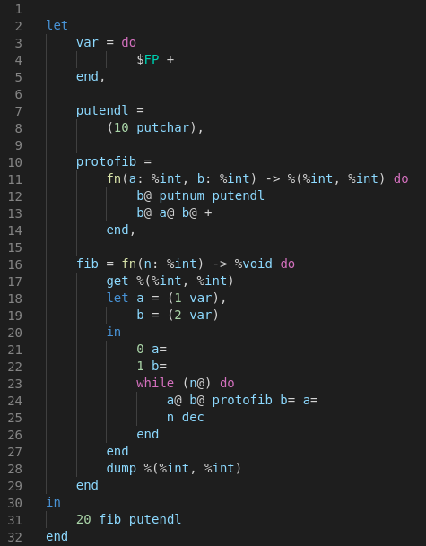
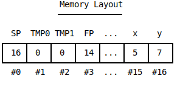

<div align="center">
  <h1>⚓harbor⚓</h1>

  <p>
    <strong>A language that ports: examining the limits of compilation.</strong>
  </p>

  <p>
    <a href="https://www.buymeacoffee.com/adam.mcdaniel" rel="nofollow"></a>
    <a href="https://opensource.org/" rel="nofollow"></a>
  </p>

  <h3>
    <a target="_blank" href="https://adam-mcdaniel.github.io/harbor">Demo</a>
    <span> | </span>
    <a href="https://crates.io/crates/harborc/">Crates</a>
    <span> | </span>
    <a target="_blank" href="http://adam-mcdaniel.net">Contact Me</a>
  </h3>

  <sub>Written in Rust🦀💖</sub>
</div>

<div align="center">
  <a target="_blank" href="https://adam-mcdaniel.github.io/harbor">
    
  </a>
  <a target="_blank" href="https://adam-mcdaniel.github.io/harbor">
    
  </a>
  <!-- <a target="_blank" href="https://adam-mcdaniel.github.io/harbor">
    
  </a>
  <a target="_blank" href="https://adam-mcdaniel.github.io/harbor">
     -->
  </a>
</div>

***NOTE: Click the images above for an interactive demonstration!***

## About the Author

I'm a *bored* 19 year old sophomore in college working on projects to fill the time. If you enjoy my work, consider supporting me by buying me a coffee!

<a href="https://www.buymeacoffee.com/adam.mcdaniel" target="_blank">
  
</a>

## What is this project?

Harbor is a high level programming language with type checking (supports unsigned integers, booleans, characters, pointers, tuples) and manual memory management. What does that mean? Harbor is basically a stripped down version of C. What makes Harbor special then? It compiles to a dialect of [Brainf***](https://www.youtube.com/watch?v=hdHjjBS4cs8) called [Dynamic Brainf***](https://adam-mcdaniel.github.io/harbor).


Brainf*** programs are composed entirely of the following operators *only*:
<div align="center" style="padding: 10px">
  <a href="https://adam-mcdaniel.github.io/harbor" target="_blank"></a>
</div>
|Operator|Description|C Equivalent|
|:-:|-|-|
|<|Move the pointer one cell to the left.|`ptr--;`|
|>|Move the pointer one cell to the right.|`ptr++;`|
|+|Increment the current cell by 1.|`tape[ptr]++;`|
|-|Decrement the current cell by 1.|`tape[ptr]--;`|
|,|Make the current cell equal to the next byte of input.|`tape[ptr] = getchar();`|
|.|Output the current cell as a byte.|`putchar(tape[ptr]);`|
|[|Begin a loop while the cell at the pointer is not zero.|`while (tape[ptr]) {`|
|]|Mark the ending of a loop body.|`}`|
<!-- 
|Operator|Description|
|-|-|
|<|Move the pointer one cell to the left.|
|>|Move the pointer one cell to the right.|
|+|Increment the current cell by 1.|
|-|Decrement the current cell by 1.|
|[|Begin a loop while the cell at the pointer is not zero.|
|]|Mark the ending of a loop body.|
|,|Make the current cell equal to the next byte of input.|
|.|Output the current cell as a byte.| -->

Dynamic Brainf*** provides six additional operators: two for memory management, two for pointer manipulation, and two for better IO. With these new operators, it's possible to compile common abstractions like references, stack operations, and compound datatypes.

|Operator|Description|C Equivalent|
|:-:|-|-|
|?|Read the value of the current cell, and allocate that many cells at the end of the tape. Then, set the current cell's value equal to the index of first cell in that allocated block.|`tape[ptr] = allocate(tape, ptr, taken_cells); /* This uses a predefined allocator. Mine is 17 lines. */`|
|!|Read the value of the current cell, and free **+ zero** the allocated cells starting at that index.|`free_mem(tape, ptr, taken_cells); /* This uses a predefined deallocator. Mine is 7 lines. */ `|
|*|Push the pointer to a stack, and set the pointer equal to the value of the current cell.|`ref_stack[ref_ptr++] = ptr; ptr = tape[ptr]; /* ref_stack is an array of unsigned ints, and ref_ptr is initialized to zero.*/`|
|&|Pop the old pointer off the dereference stack, and set the pointer equal to it.|`ptr = ref_stack[--ref_ptr];`|
|#|Make the current cell equal to the next integer in the input buffer.|`scanf("%d", &tape[pointer])`|
|$|Output the current cell as an integer.|`printf("%d", tape[pointer])`|

To give you some perspective on just how little Dynamic Brainf\*\*\* adds, ***the code responsible for assembling Dynamic Brainf\*\*\* in this compiler is just 24 lines long!*** You can write a compiler for it just using string replacement!

## How does it work?

Harbor source code goes through three stages before the output code: HIR, MIR, and LIR.


HIR provides a typesystem and performs typechecking, MIR provides a small untyped reverse-polish-notation assembly language, and LIR is an internal representation of Dynamic Brainf\*\*\* specially structured to optimize generated code.

The most interesting part of the compilation process is the transition from Harbor MIR to Dynamic Brainf***. Harbor MIR looks like this:



### Memory Layout

MIR provides 14 registers:
- `SP`: the stack pointer.
- `FP`: the frame pointer.
- `TMP0` through `TMP5`: 6 temporary registers for helping with arithmetic operations. These are compiler only.
- `R0` through `R5`: 6 general purpose registers for the user.

The registers are statically allocated by the compiler at the first 14 cells, with the stack beginning immediately after.


You might notice that `FP` strangely comes after `TMP0` and `TMP1`, but before `TMP2`. There's a good reason for this: copying memory cells in Brainf*** dialects is a *very expensive* (and very frequent) operation. When memory is copied, it uses `TMP0` as a buffer:


So, `TMP0` is placed before `FP` to increase locality (it takes fewer cycles to shift the pointer to `TMP0`), but I'm sure the effect is negligible. `TMP1` is also placed before `FP` for similar reasons: it's used frequently in almost all alrithmetic operations. `TMP2` through `TMP5` are more specialized registers, mainly used for integer division, multiplication, and setting up stack frames and activation records for functions.

### MIR Opcodes

|Opcode|Description|
|-|-|
|`set 123`|Pops an address and stores a value at that address|
|`=` (called `Store` internally)|Pops an address and pops a value into that address. Also takes an optional size parameter for the number of cells store at the address like: `%int`, `%(%int, %bool)`, or `%char`.|
|`@` (called `Load` internally)|Pops an address and loads a value from that address. Also takes an optional size parameter to load from the address like: `%int`, `%(%int, %int)`, or `%char`.|
|`get %int` (called `Stalloc` internally)|Pushes a block of memory on the stack with the given size. `%int` allocates one cell, `%(%int, %int)` allocates 2, etc.|
|`dump %int` (called `Stfree` internally)|Deallocates a block of memory on the stack with the given size (`%int` is one cell).|
|`123`|Integer literals are pushed to the stack.|
|`+`|Pop two numbers off the stack and push their sum.|
|`-`|Pop two numbers off the stack and push their difference.|
|`*`|Pop two numbers off the stack and push their product.|
|`/`|Pop two numbers off the stack and push their quotient.|
|`==`|Pop two numbers off the stack and push their equality.|
|`!=`|Pop two numbers off the stack and push their inequality.|
|`\|`|Pop two numbers off the stack and push their logical or (anything not zero is true).|
|`&`|Pop two numbers off the stack and push their logical and.|
|`!`|Pop a number off the stack and push its logical complement.|
|`alloc`|Pop a number off the stack, allocate that many cells at the end of the tape, and push the address of the allocated block.|
|`free`|Pop an address off the stack and free the cells at that block.|
|`dup`|Duplicate the top cell on the stack.|
|`frame %int -> %(%int, %int) do ... end`|Create a stack frame for a code block that takes an argument and returns a value. The FP points at the first argument, and the return value is left on the stack when the code block ends after the frame is destructed.|
|`if (2 4 *) do ... end`|Perform an if statement. Else clauses are not supported: it's complicated, but essentially nested if-else statements would walk over each other's saved conditions in the stack.|
|`$R0`, `$R1`, ..., `$R5`|Push a register's value onto the stack.|
|`&R0`, `&R1`, ..., `&R5`|Push a register's address onto the stack.|

There are also 6 predefined macros for MIR. `putnum` and `putchar` both pop a cell off the stack and print it. `getchar` retrieves a byte of user input and pushes it onto the stack. `getnum` retrieves an integer from user input and pushes it as well. Finally, `inc` and `dec` increment or decrement the value pointed to by the top value on the stack.

MIR opcodes are composed of a sort of "microcode" that's really interesting and fun to write/optimize. The code generator for the addition opcode illustrates this pretty well:

<div>
  
  <span align="top" style="float: right; width: 50%; height: 100%; display: inline-block">
    
  </span>
</div>


Originally, I implemented addition by popping the two values into temporary registers (`TMP1` and `TMP2`), performing the addition, and then pushing the result onto the stack. This solution is much more efficient, as everything is done in place instead of moving values around in memory!

It's also very satisfying to see the result of the optimizations on the output code as well: because ***everything*** implemented in Brainf*** seems to be on the order of O(n^2), any reduction in memory usage seems to have a dramatic effect.

These microcode blocks can also get absurdly long: *division is upwards of 60 instructions!*

### Harbor Frontend

Harbor's frontend is significantly more cozy than its MIR; looking at it you wouldn't know it's a terrible, horrible language!


Harbor supports method like syntax for function calls, `let` type inference, pointers with indexing `[]` and dereference `*` operators, tuples, heap allocated string literals, and a strict type system.

Its syntax is Rust inspired, but with several slight quirks. Because of the way MIR internally represents scopes and frames, it was much simpler to implement expressions in an explicitly chained manner:

```rs
let z = 11 in
  putnum((let x = 5,
      y = 6 in x + y * z))
```

With this syntax, scopes are explicitly created and destructed upon individual expressions: they're managed by simply creating a frame for each `let` expression, and destructing it at the end of the `let` body.


Because method calls are just syntax sugar for function calls, the user needs an alternative way to pass the "self" parameter as a pointer. To do this, I increased the precedence of `&` to take place before the `.` and `->` operators. So, in the example above, the expression `&n.inc.square->putnumln` expands to `putnumln(*square(inc(&n)))`. I know this syntax looks confusing to anyone familiar with pointers, but it's impossible to misuse due to the strict typesystem.

## The Recursion Problem


This seems to be the only area where Harbor really lacks in its domain. The way the compiler is constructed, it is basically impossible to implement recursion in a sane way.

In a language like Brainf\*\*\*, where the only method of control flow is looping, implementing functions with scopes is difficult enough: it's exceedingly hard to simulate function calls and frames without any mechanism for jumping to an arbitrary instruction.

***This can be accomplished***, however using a technique where code blocks are divided into "basic blocks": code without any jumps inbetween the beginning and end. This simplifies the structure of the program such that jumps don't occur in the middle of execution: *control flow only needs to be monitored and managed between basic blocks, which can easily be done with traditional if statements and while loops!*

Unfortunately, though, I was not aware of this solution at the time I implemented most of the compiler, and implementing it probably would have taken far too long anyways. The important thing to note is that ***it is possible*** to compile recursive, functional code to Dynamic Brainf***.

## Exercises for the reader

- ***LLVM or x86 Dynamic Brainf\*\*\* Compiler***: Harbor compiles its output Dynamic Brainf\*\*\* to C, but other compilers targeting **LLVM** or **x86** would be a significant improvement.
- ***Reverse-Engineering-Optimizing Dynamic Brainf\*\*\* Compiler***: because of the way Harbor compiles code, optimizations can easily be applied by *reverse engineering* the output code. For example: each MIR arithmetic stack operation *always* compiles to the same result. To optimize the compiled Dynamic Brainf*** code, simply compile the code responsible for an opcode *as the actual opcode operation* instead of performing **hundreds** of small Brainf*** operations to achieve the same thing! With such a compiler, Harbor could be as efficient as unoptimized C (This sentence brings me great shame)!
- [Hardware Implementation](https://www.youtube.com/watch?v=-l9ookS6pHw): imagine running this terrible language *natively!* All of the fun debugging with a shell, but *with an oscilloscope instead!*
- [Minecraft Brainf*** Implementation](https://www.youtube.com/watch?v=fZzcYkgkQ-I): it would be entirely possible (*and exceeding difficult*) to implement a 5 or 6 bit implementation (the minimum possible address size is 5 bit, as 4 bit only leaves 2 cells for the stack) of a Dynamic Brainf*** machine, possibly with simplified IO, that could run this compiler's output code natively!

## Usage

To install and use, you must download [the Rust programming language](https://rust-lang.org).

#### Development Build

```bash
# Install directly from git with cargo
cargo install --git https://github.com/adam-mcdaniel/harbor

# Or, alternatively, the repo and install from source
git clone https://github.com/adam-mcdaniel/harbor
cd harbor
cargo install -f --path .
```

#### Releases
To get the current release build, install from [crates.io](https://crates.io/crates/harborc).

```bash
# Also works for updating harbor
cargo install -f harborc
```

#### After Install

```bash
# Just run the harbor executable!
harbor
```
